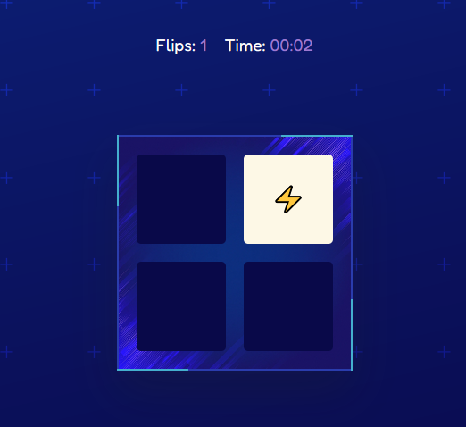
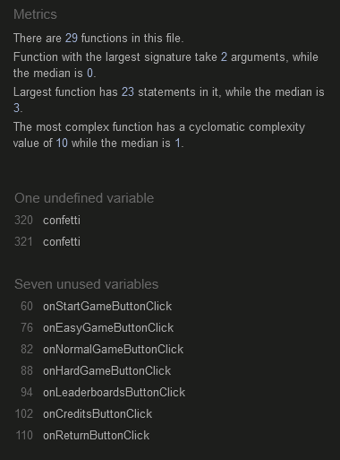

# Memoria

### A website for a memory-card game, allowing users to strengthen their memorisation.

[Memoria - Live Website](https://ryael.github.io/memoria//)

Memory is a fundamental part of our lives. Without memories, our perception of time would be distorted and lose most of its meaning. It's our ability to recall recent experiences, knowledge, and emotions, paving the way for those short term memories to become long term memories. That doesn't, however, mean that this improving our memory needs to be a chore! In fact, it can be a lot of fun.

Growing up, I was always fond of browser based games and spent many a day on the computer playing all sorts of mini-games on the family computer. Out of those mini-games, my personal favourite was memory card games where you're presented with a set amount of images and upon interaction with them, they will flip up and reveal what sort of design is hidden underneath. Your objective is to memorise which designs are where and match up pairs, until the entire board is matched. It's quite simple in theory but it can also put your short-term memory to the test, and it definitely is fun to see how well you can push yourself to achieve the fastest time possible. Without cheating, of course! Nobody likes cheaters and I believe that you aren't a cheater!

This is my second milestone project as part of Code Institute's Diploma in <strong>Software Development (E-commerce Applications)</strong>.

I decided to create an interactive memory-card game using JavaScript that used emoji icons as its hidden images. The key term I'd use to describe the pool of emoji chosen is "traditional role-playing game concepts". This includes: bow-and-arrow, bomb, fire, water, lightning, ribbon, puzzle-piece, anchor, and die. The idea here was to evoke a sense of traditional fantasy concepts that feels familiar, straightforward, and cozy.

This website is a single-page-application (SPA) that has a consistent design throughout all its content and is both simple and pleasing to navigate. Content is either toggled between displayed and hidden as necessary, or is generated and destroyed via the use of JavaScript. All content present adheres to my themeatic vision and only contains what is necessary. My vision for this website was for it to feel and act like an application, which is why transitions were added to make the process of navigating the menus as smooth and pleasant as possible. 

The content includes the memory game itself, a Main Menu, a Rules & Difficulty menu, a Leaderboards section, a Credits section, and links to my social media in the footer. The memory game is available on three different difficulities, the Leaderboard section shows the top ten players for each difficulty, and the Credits section contains instructions on how to report bugs and attribution links for the images used.

The website is fully responsive at all screen sizes, adapting well to smaller resolutions for tablets, phones, and even landscape view on the aforementioned. It also works as intended on all popular web browsers. 

## Table of Contents

1. [Project Goals](#project-goals)
    - [User Goals](#user-goals)
    - [Site Owner Goals](#site-owner-goals)
2. [User Experience](#user-experience)
    - [Target Audience](#target-audience)
    - [User Stories](#user-stories)
3. [User Interface](#user-interface)
    - [Design Philosophy](#design-philosophy)
    - [Fonts](#fonts)
    - [Wireframes](#wireframes)
4. [Features](#features)
5. [Validation](#validation)
    - [HTML Validation](#html-validation)
    - [CSS Validation](#css-validation)
6. [Testing](#testing)
    - [Accessibility](#accessibility)
    - [Performance](#performance)
    - [Device Testing](#device-testing)
    - [Browser Compatibility](#browser-compatability)
    - [Testing User Stories](#testing-user-stories)
7. [Bugs](#bugs)
8. [Future Updates](#future-updates)
9. [Deployment](#deployment)
10. [Technologies Used](#technologies-used)
    - [Languages](#languages)
    - [Frameworks & Tools](#frameworks-&-tools)
11. [Credits](#credits)
12. [Acknowledgements](#acknowledgements)

## Project Goals

The aim of this project is two-fold:
- To demonstrate my knowledge of JavaScript in tandem with HTML and CSS, to document my experiences, difficulties, and solutions developed. No other languages or frameworks were used in the development of this project.
- To adhere to my thematic vision of a SPA from a UI/UX perspective, creating a website that allows for an enjoyable experience for anyone visiting the website. 

### User Goals

- Find a mini-game for a short-term distraction
- Find a mini-game that can help train and improve your short-term memory
- Find a mini-game that kids can enjoy while training their short-term memory
- Find a mini-game with a sense of progression in terms of difficulty
- Find a clear and concise elaboration of the game-rules and how to play
- Find the developer's contact details
- Contact the developer about any bugs, game-breaking or otherwise
- Read about how to report bugs and where the images were found
- Investigate if the developer has created any other games

### Site Owner Goals

- Provide an enjoyable mini-game that has memory benefits
- Provide different difficulites, creating a sense of progression
- Provide feedback to the player after they finish a game
- Create a smooth experience in navigating the menus
- Provide a clear explanation of the game rules and difficulty
- Provide links to the developer's social media should players discover any bugs
- Make the website responsive for mobile devices, as [over 50% of traffic comes from mobile users](https://www.statista.com/statistics/277125/share-of-website-traffic-coming-from-mobile-devices/)

[Back to Top &uarr;](#memoria)

## User Experience 

### Target Audience

- People who are looking of an enjoyable way to train their short-term memory
- People who are looking for a quick break in an otherwise hectic lifestyle
- People who are looking for a mini-game that's simple enough for children
- Fans of memory card games
- Fans of traditional fantasy concepts
- People who are looking for a mini-game with an escalating level of difficulty

### User Stories

#### First Time Visitors

1. As a first-time visitor, I want to easily understand the main purpose of the game.
2. As a first-time visitor, I want to easily navigate the menus without getting lost.
3. As a first-time visitor, I want to learn about the developer.
4. As a first-time visitor, I want to learn where the images were sourced.
5. As a first-time visitor, I want to learn what the game rules are.
6. As a first-time visitor, I want to know what difficulties are available to me.
7. As a first-time visitor, I want to feel engaged when playing the game.
8. As a first-time visitor, I want to be provided visual feedback upon beating a round.

#### Returning Visitors

9. As a returning visitor, I want to quickly check if any new difficulties or game modes have been added.
10. As a returning visitor, I want to progress through the difficulty levels to strengthen my memorisation.

#### Site Owner

11. As the site owner, I want to clearly showcase the memory game.
12. As the site owner, I want users to be able to navigate the menus smoothly and easily.
13. As the site owner, I want to adhere to a specific vision and provide users with a very engaging game via its design and imagery.
14. As the site owner, I want to provide a clear explanation of the game-rules and the different difficulties.
15. As the site owner, I want to provide my social media contacts should users need to report a bug.
16. As the site owner, I want to provide attribution links to the source of the image.
17. As the site owner, I want to provide players a fun and beneficial game that can be enjoyed by players of all ages.

[Back to Top &uarr;](#memoria)

## User Interface

### Design Philosophy

The design of this website began with a simple vision: I wanted to craft a clean and simple SPA with that was based on the old predominately [blue PS3 home theme](docs/screenshots/ps-theme.webp). With this as my core inspiration, the overall design of the website began to take form in my mind's eye. My idea was to find and use an image as the background that had a smooth and subtle light-blue to dark-blue gradient. After much searching I found [this lovely specimen on Freepik](https://www.freepik.com/free-vector/gradient-particles-background_4298560.htm#query=gradient%20particle%20background&position=0&from_view=search&track=sph). It has that exact colour scheme and wave-like particles that I had in mind, after some manipulation I arrived at the current [background image](assets/images/background/main.png). This, combined with some simple and sleek visual menu elements is what makes the foundation of this project. I had hoped for the end result to be a combination of flashy and clean, which is a difficult balance to achieve but I think I was mostly successful and quite happy with the visual end result overall.

All sections of the website follow a similar structure with the "Memoria" title at the top of the page, the footer with the social icons at the bottom, and all interactive elements have similar hover/focus effects wherein they fade-in on mouse-over/interaction and fade-out gently on mouse-leave. This is done to establish a consistency throughout the website such that users become familiar with how interactive elements respond. The Rules & Difficulty, Leaderboards, and Credits section have a white with a slight hexagonal pattern as their main element as they contain text elements. Otherwise, the game portions of the website all possess complementary elements to the rest of the site, creating a sense of flow familiarity for new users.

On smaller viewports, the content expands to 80-100% of the width to reduce user scrolling burden and to allow for easier viewing. The exception to this is the memory game itself. On the easy and normal difficulties, the game board always keep to a square ratio. However, on the hard difficulty, the game board takes the shape of rectangle to best use as much of the available vertical space. This is intentional, as otherwise the cards become far too small on smaller resolutions to interact with and would be an accessibility nightmare.

You can find the images used for all the backgrounds below:

    
Website Background

    

    
Game Background

    

    
Settings Background

    

### Colours 

No pre-set colour palettes were used in the designing of this website. My vision was to have the site feel simple, clean, but also fancy and packing a bit of a flavourful punch. I wanted to focus on primarily three colours: blue, white, and purple. Shades of blue are used to establish structures and give form to the most important structures in the background, the game itself, and the game background. White is mainly used as the font and the buttons. Purple is used as an accent to the blue, often being used as the link and highlight colour. [Color-Name](https://www.color-name.com/) was used to find slightly lighter and darker shade variations of the colours used for this project. The text content is primarily dark-blue on a white background with darker titles. Buttons and their text elements are either entirely white that transition to purple or vice versa.

### Fonts

The fonts I chose for this project are Jost and Fredoka. Fredoka is the font for the general content, whereas Jost is used for title content. Prior to Jost, I had chosen and used Josefin Sans as my title font of choice. I saw it used [as a title here](https://elementor.com/blog/font-pairing/) and decided it was that geometric and retro look I wanted to introduce the user to the website. However, it unfortunately had uneven padding on its top and bottom, which is simply just how the font was designed. This made it very difficult to creative even padding areas. As such, I ended up looking for a similar font and fortunately Jost is visually very similar, and in fact, the shape of the capital "M" is even more visually appealing than what Josefin Sans had to offer. 

Fredoka was chosen because of it's round edges and overall bold and daring appearance. It epitomises "fun" and I figured this was perfect for text content on a browser game website. They complement each other well although I hadn't found any pairings that used these two before. I think this is a fairly specific case that works which otherwise wouldn't work if the design philosophy was more minimalistic.

Font-weights of 300, 400, and 600 were chosen for Jost and font-weights of 400 and 500. 400 was used as the default for both. 600 was used for a bit more weight and clarity, primarily in titles and especially the "Memoria" page title.

### Wireframes

The conceptualisation of the layout used in this project began with simple pen and paper sketches, which were then transformed into wireframes via Balsamiq. Everything shown here is a rough beta of the layout, some of which has changed during development.

This is the prototype of the project, which changes over the course of project development.

    
Main Menu

    

    
Settings Window

    

    
Game Board

    

[Back to top &uarr;](#memoria)

## Features

### Title

The Title is the first things users will see when loading the page and its geometric and retro look is here to make an impact. It's bold and assertive with its heavy font-weight and contrasting white on blue, and establishes the sort of design philosophy the rest of the website will adhere to. Upon mouse-over and focus, it plays [a subtle animation](docs/features/header-title-animation.gif) and converts the user's cursor to that of a pointer to indicate that it's an interactable element. Upon interaction it plays a script that reloads the page, effectively bringing the user to the Main Menu. As such, no matter what part of the game the user has navigated to, they are always a simple click or tap away from going back to the Main Menu. The name "Memoria" is simply a play on the word "memory" and has no other significant meaning aside from aesthetic preference.

### Main Menu

The Main Menu is fundamentally the navigation menu for the website and also doubles up as the landing page. Upon loading into the page, the user is greeted by a subtle fade-in transition, which is used throughout the entirety of Memoria. It keeps people who prefer reduced motion in mind and is quick and simple on the eyes. From the Main Menu, the user has the option to: a) start a game, b) view the Leaderboards, or c) read the credits. All the [buttons have animations](docs/features/main-menu-animation.gif) that play upon hover/focus. A smooth fade in, and smooth fade out. Upon interaction, a script runs that hides the Main Menu and displays the relevant area instead. For example, clicking on Start Game will hide the Main Menu and instead display the Rules & Difficulty section alongside the return button, which can bring the user back to the Main Menu.

### Rules & Difficulty

The Rules & Difficulty section introduces the rules of the game and the overall objective of the game. It also provides three buttons that allow the user to select their difficulty of choice. The difficulty level itself is explained within the name, where easy is 2x2, normal is 4x4, and hard is 6x6. From a single glance it is clear exactly what each button accomplishes. Their colour palettes are inverted due to the white background but [a similar animation](docs/features/rules-difficulty-animation.gif) plays upon hover/focus. Similar to Main Menu's script, upon interacting with any of the difficulties, the Rules & Difficulty section will be hidden and the game-board will be generated based on which difficulty was selected. 

### Memory Game - Easy

Here is where the magic happens! This is the core functionality of the website that displays a 4-card grid upon being the Easy mode button being interacted with. The previous menu is hidden but the game itself is written such that the timer doesn't start counting until the user clicks on a card. There's nothing worse than games that have their timers begin counting before the user is even able to take an action. The emoji are randomised each time using a shuffle method but they are always pulled from the same list of emoji. The emoji approach is quite novel as it allows the website to not have to load images everytime as every device has their own version of emojis built in. 

The game board also has a simple border animation that runs around the edges, drawing the user's focus towards the game board. Upon selecting a card, they flip upwards. Upon selecting two non-matching cards, they both briefly shake to provide the user with visual feedback that there hasn't been a match before flipping back down. However, upon selecting two matching cards, the cards remain flipped. Once all the cards have been flipped, the board itself flips. At this point two things occur simultaneously: 1) the user is presented with their amount of flips and the time elapsed in minutes and second, and 2) a confetti script is run to give the user a reason to celebrate their victory. [Here is the example](docs/features/border-animation.gif) of the animated border and the win screen with the confetti. This is perfect for younger kids as it's flashy enough to keep them invested and to get a taste of what memory games are like before diving into the higher difficulties.

### Memory Game - Normal

Normal mode is pretty much identical to what is described up above except that the game board generates a 16-card grid. This is pretty much the ideal difficulty to play as it strikes the sweet spot between easy and normal, and is commonly what one would see when looking at other memory card games. It doesn't take too long but still tests the user's short-term memory. It's a nice and relaxing difficulty mode. Both the easy and normal modes retain their square ratio across all resolutions.

### Memory Game - Hard

Hard mode is very similar to the other two difficulties but the key difference is that it generates a 36 card grid. Playing on hard mode is significantly more time consuming and can take as much time as two full normal mode games, however, this game mode is here for those who are really trying to push their abilities and test their memory. Completing the game to have the board flip and seeing the confetti is extremely satisfying considering the time and effort needed to be put in, but I'd like to believe that it's all worth it! If the user is looking for a challenge, then they need look no further. Hard mode maintains a square ratio for most viewports except the very small and narrow ones, at which point it flex-wraps into a column. This is to make the best use of the vertical space, ensure that the cards themselves aren't too small, and prevent the game-board from overflowing entirely.

### Return Button

The Return to the Main Menu button is present on every section but the Main Menu. Its purpose is to bring the user back to the Main Menu as it simply plays the same reload script as the Title does, resetting the page to its default state: the Main Menu. It has the exact same animation as the other Main Menu buttons and is even styled the same to ensure consistency and familiarity. 

### Leaderboards

The Leaderboards section is unfortunately not finished. It was intended to be a section where players could select one of the three corresponding difficulties to display the top 10 times for each. Due to no backend knowledge, the intention was to use a service like [Parse Platform](https://parseplatform.org/). However, I ended up running out of time and didn't want to rush and ultimately fail properly implementing this, hence this feature will be implemented in the future.

### Credits

The Credits section is very similar to both the Rules & Difficulty and Leaderboards sections, both in how it displays and hides the other content and how it looks. Here the user can find my details and information on how to best contact me in the event of a bug. It also attributes the images used from FreePik.

### Footer

The Footer of Memoria displays three social icons which are created via Font Awesome. These are links to my GitHub, LinkedIn, and E-mail. No more were added as the intention was to keep this strictly professional. The Footer is present in all sections, providing the user with easy and direct methods to contact me to report bugs or any other reason. They also have [a unique animation](docs/features/footer-icons-animated.png) that fades in and out, similarly to the buttons.

### Favicon

As with all websites, this one also has a Favicon that is displayed beside the Title of the page. A user can quickly and easily discern if they have Memoria open amongst many different tabs by looking for the capital "M" icon, which is rendered in the same font as the Title text, Jost.

[Back to top &uarr;](#memoria)

## Validation

### HTML Validation

[W3C Markup Validation Service](https://validator.w3.org/nu/) was used to validate HTML code. No errors were found. 

### CSS Validation

[W3C CSS Validation Service](https://jigsaw.w3.org/css-validator/) was used to validate CSS code. No errors were found. 

### JavaScript Validation

[JSHint](https://jshint.com/) was used to validate JavaScript code. It detected two undefined variables; however, they are from a library, which is where they're defined. It also detected seven unused variables are called from the DOM and hence JSHint is unable to detect that they are used. There were no errors found otherwise.

[Back to top &uarr;](#memoria)

## Testing

### Responsiveness

[Website Responsive Test Online](https://websiteresponsivetest.com/) was used to extensively test the responsiveness of Memoria. All screen sizes and viewports are now accounted for, including even extremely small screen-widths like 240 px.

### Accessibility

[WAVE WebAIM](https://wave.webaim.org/report#/https://ryael.github.io/memoria/) was used to check for accessibility and no errors were found.

### Performance

Google Lighthouse was used to assess the performance of this website. All tests were performed in incognito mode to avoid interference from any other sources. Tests were carried out on each section but the same result was returned every time. This was the same case for mobile, and as such, only one result will be provided. Performance could be improved yet again but I made a choice to not convert the main background due to the colours becoming [visibly distorted](docs/testing/background-issue.png). 

### Device Testing

The website was tested on many different devices, such as:

- Samsung Galaxy S10
- Samsung Galaxy S21
- Samsung Galaxy Note 8
- MSI GE72 6QF Apache Pro
- iPhone 8
- iPhone 10
- iPhone 11
- iPhone 11 Pro
- iPhone 12
- iPhone 14 Pro Max
- iPad Mini (Landscape and Portrait)
- iPad (Landscape and Portrait)
- Vivo S1 Pro
- LG v60
- Huawei P40 Pro
- Google Pixel 6

### Browser Compatibility

- Mozilla Firefox
- Google Chrome
- Opera
- Safari
- Microsoft Edge

I tested the website extensively on Mozilla Firefox, Google Chrome, and Microsoft Edge. For the remaining two, I asked friends and family to test the website on my behalf while overlooking it to ensure cross-compatibility. No issues or bugs were reported.

### Testing User Stories

1. As a first-time visitor, I want to easily understand the main purpose of the game.
    - Upon navigating to the website, the user is automatically greeted with a clean and easily readable Main Menu that allows them to go to their page of choice. The Start Game button will bring them to the Rules & Difficulty section, where they can read about the rules and objective of the game.
    - At this point, users can then select a difficulty to start a game and see first-hand what the purpose of the game is.
    - In addition to this, they may navigate to the GitHub via the Footer and/or the Credits section, where they can read the introduction of the readme in order to ascertain the purpose.

2. As a first-time visitor, I want to easily navigate the menus without getting lost.
    - The website was designed to be easy to navigate and fluid. The top of each section has a Title which doubles as a back button alongside the actual Return Button, with clearly described descriptions so the user has an idea of where they'll end up upon interaction.
    - Every section always has a clear means of moving forwards or backwards, ensuring the user is never lost or overwhelmed.

3. As a first-time visitor, I want to learn about the developer.
    - Navigating to the Credits section is the best and most simple way to learn more about the developer, as it contains a short blurb, a means to report bugs, and attribution links for the images used throughout the project.
    - Additionally, the icons in the Footer allow the user to visit the developer's GitHub or LinkedIn, where they may learn additional information.

4. As a first-time visitor, I want to learn where the images were sourced.
    - The Credits section will hold the answer to this, as it contains full attribution links to the images, their source, and who they were designed by.

5. As a first-time visitor, I want to learn what the game rules are.
    - Simply pressing Start Game will bring the user to the Rules & Difficulty section, which clearly lays out the rule of the game, the objective, and how the difficulties differ.

6. As a first-time visitor, I want to know what difficulties are available to me.
    - Navigating to the Rules & Difficulty section by interacting with Start Game will bring the user where the difficulties are displayed via buttons alongside a clear descriptor of how they differ from each other.
    - To add to this, they can click on each difficulty before returning to the Main Menu and clicking on the others to see the difference for themselves.

7. As a first-time visitor, I want to feel engaged when playing the game.
    - Upon starting the game via any of the difficulty buttons, the board is faded in as it generates with a subtle yet fitting background and an additional animation that runs around the border of the board.
    - Additionally, feedback is provided to the user via the cards shaking upon an incorrect match being made. 
    - Further yet, the game-controls area shows the amount of flips they've made and the amount of time that has elapsed, allowing them to keep track of their moves and become more invested.

8. As a first-time visitor, I want to be provided visual feedback upon beating a round.
    - Upon the completion of the game on any difficulty, an animation is played where the board flips and confetti starts firing, increasing the user's engagement with the game by providing visual feedback of their accomplishment. 

9. As a returning visitor, I want to quickly check if any new difficulties or game modes have been added.
    - If the UI remains the same and there isn't any additional element that informs the user of an update, then they could check the GitHub to see if any updates have been made to the game.
    - Ultimately, they could also visit the Rules & Difficult section of the application to see whether or not new games modes or extra difficulties have been added as of yet.

10. As a returning visitor, I want to progress through the difficulty levels to strengthen my memorisation.
    - This is easily accomplished by starting with whichever difficulty the user may have left off on and work their way up the ladder that ends with the hardest difficulty.
    - At this point the user should attempt the fastest clear time possible without any means of cheating to hone their memorisation.

11. As the site owner, I want to clearly showcase the memory game.
    - The application is designed with the game at the forefront; the menus are sleek and easy to navigate, the semantic structure suggests that there is a game available here, and the clear labelling of buttons will bring the user to the game within seconds.

12. As the site owner, I want users to be able to navigate the menus smoothly and easily.
    - The website has a very clear Main Menu, with easily seen text due to the contrast of the background and the colour of the links. This allows for a smooth navigation experience.
    - Each section is built to be fluidic and flow in a coherent manner where the user learns relevant information as they go through each section of each page.

13. As the site owner, I want to adhere to a specific vision and provide users with a very engaging game via its design and imagery.
    - The consistency of the effects and colours used provide an experience that succeeds bringing many separate parts together to form something that's more than the sum of its parts.
    - All the backgrounds used are primarily blue with some purple hues to create a colour synergy and the application never deviates from its theme.
    - The game portion of the application itself is designed to provide as much feedback to user as possible, hopefully providing them with a highly engaging experience.

14. As the site owner, I want to provide a clear explanation of the game-rules and the different difficulties.
    - Users can find the explanation of the rules, objective, and different difficulties in the Rules & Difficulty section, which covers them succintly. 

15. As the site owner, I want to provide my social media contacts if users need to report a bug.
    - The Credits section links to the issues page on the relevant GitHub page and explains that this is the ideal place to report bugs.
    - Additionally, users may navigate to the Footer of the application and further navigate to the GitHub via that or send an e-mail altogether.

16. As the site owner, I want to provide attribution links to the website where I sourced images from.
    - The attribution links, where the images were found, and who they were designed and uploaded by can all be found within the Credits section, which contains clearly laid-out and high-lighted links.

17. As the site owner, I want to provide players a fun and beneficial game that can be enjoyed by players of all ages.
    - Due to the different difficulties available, especially easy, and the fun and flashy design direction of the application, it's something even younger kids can pick up and learn to enjoy. The concepts don't take much learning and the confetti upon winning will be all the encouragement they'll need.

[Back to top &uarr;](#memoria)

## Bugs

1.  **Intended Outcome:** Image not covering the entire screen -> new image crop: Done
    * **Issue:**
    * **Cause(s):**
    * **Solution:** 

2. Title text, Josefin Sans, spaced weirdly -> new font

3. After using Return/Back button, all the previously displayed containers weren't hidden. Fix: Hiding the aforementioned containers when the back button is clicked.

4. Easy Game Mode:  Meant to display 2 x 2 grid. It displays the grid correctly, but only one of the two pairs of emoji is being shown: https://i.imgur.com/qzmfRJk.png. Fix: replace emoji that wasn't rendering properly with emoji that is.

5. The win state is being displayed (it shouldn't be). https://i.imgur.com/1u3E2Xn.png Fix: #memory-game had a #111 background that covered the win window. Removing that helped. + class selector instead of id selector. fixed completely.

6. It's not properly centered alongside the timer.  fix: game stats contaienr was within the same container, causing it go beside the game. Fix: moving the container up a level/div & adding a script to the easygamemode script that allows the game-stats to be display from a none-display state.  typo in the constant selectors (no # for idselector)

7. selecting the pair of correct emoji doesn't add the matched class to them. incorrect id/class: check bugfix commit.

8. Game bug too many clicks or interactions (mobile), the event listener breaks and stops adding the flipped/matched class, making it unable to progress the game. Fix: add setTimeOut script.

9. Game needs to be destroyed if the player wants to play on a different difficulty. / after finishing Fix: add location.reload() as a script to main-menu button/return. This was later set as the main functionality for the button.

10. bug: scrollbar appears in game-area. fix: remove overflow:auto;

11. Widescreen (ultra and above 2k), difficulty buttons too small. Fix: adjust media query for it.

12. returnButton would display the menu briefly before the reload and the transitional effects that followed. Fix: Remove hide/show scripts.

13. Entire title container is being used as returnButton, should only be the title. Fix: Move returnButton() to h1 instead.

14. Spam click the same card, removes the class from only card. Only one shakes, the other doesnt. Fix: add delay to shake and flip.

15. bug:  border-animation still displaying after flip/win on chrome. solution: add display none to the animated borders on flip.

16. after the board was made responsive, emoji out of place: https://i.imgur.com/6kySFqh.png Media query to target size and position.

17. Easy and normal broken after hard was made responsive: https://i.imgur.com/ifLs4qo.png Fix: media queries that target normal and easy modes. Fix: Adjust generateGame script with the inclusion of template literals to create 3 different boards (board-2, board-4, board-6) to better manipulate all with separate media queries.

18. Animated border appears far of to the right side on the smallest media query. Fix: add overflow: hidden to #board-container to hide it.

19. Game stats very small on newer gen phones: target via media query height and width and increase size. Esy fix.

20. Flip counter was adding extra flisp to the total if you went too fast. fix: moving state.TotalFlips++ into the if statement where there has to be less than 2 total flips existing at any time.

All bugs were due to my own code and were usually fixed as soon as identified due to the fact that they originated from my own mistake. No pervasive bugs were found.

[Back to top &uarr;](#memoria)

## Future Updates

1. Sticky Navigation Bar - This was part of my vision for the website but I was unable to find a solution to this without relying on JavaScript. My vision is as follows: I wanted the Navigation Bar to be transparent when it was resting above the Hero Images, but once it left those regions, it would become an opaque black colour as it follows the user down the page.

2. Fullscreen Hamburger Menu - This is very difficult to accomplish without JavaScript and I found myself struggling with the current hamburger menu as is. My vision for this was to have the entire screen to be covered in white with links in black structured in a column appearing the middle.

3. Coaching Pricing Plan Comparisons - This was part of the plan for the website but I found myself not having the time necessary to bring this idea to light. Hence, I plan to work on it in the future and put it at the top of Coaching page, so users are available to compare plans with just a single glance.

4. Google Map - This was originally a part of the website but it caused major performance issues and hence was removed and instead replaced by an image.

5. Testimonials - This was originally a part of the plan for this project but unfortunately, Google Reviews aren't too easy to embed without having to pay for the service. The alternatives are well over my head but it's definitely something I'd like to look into in the future.

I'd like to revisit this project in the future after having learned more about JavaScript, especially if Ronan Kiely of Victory Fitness would be interested in using this website.

## Deployment

This project was deployed to GitHub Pages using the following steps:

1. Log in to GitHub and locate the repository: [Victory Fitness](https://github.com/Ryael/victory-fitness).
2. Locate the Settings button, and then click it.
3. Scroll down to the Pages section, which is found under "Code and automation".
4. Under "Source", click the dropdown called "None" and select "Master Branch".
5. The page will then automatically refresh.
6. Scroll back to the top of the page to locate the now published website link.

It can also be forked via the following steps:

1. Log in to GitHub and locate the repository again, as described above.
2. At the top right corner of the repository, you will see a "Fork" button. Click on it.
3. You will then be asked where you want to save it, so choose a location.
4. You now should have a copy of this repository in your own GitHub account.

[Back to top &uarr;](#memoria)

## Technologies Used

### Languages

- HTML 5
- CSS 3

### Frameworks & Tools

- [GitPod](https://gitpod.io) - IDE used to code and build this project.
- [GitHub](https://github.com/) - The repository was created here, is currently stored here, and was deployed via the GitHub Pages features.
- [Balsamiq](https://balsamiq.com) - Used to create wireframes.
- [Obsidian](https://obsidian.md/) - Used to take notes and create to-do lists.
- [Adope Photoshop](https://www.adobe.com/products/photoshop.html) - Used to crop, resize, and edit images.
- [W3C HTML Validator](https://validator.w3.org/) - Used to validate HTML code.
- [W3C JigSaw Validator](https://jigsaw.w3.org/css-validator/) - Used to Validate CSS code.
- [WAVE WebAIM](https://wave.webaim.org/) - Used to check accessibility.
- [Google Lighthouse](https://chrome.google.com/webstore/detail/lighthouse/blipmdconlkpinefehnmjammfjpmpbjk) - Used to check performance, SEO, accessibility, and best practices.
- [Mozilla Firefox Developer Tools](https://www.mozilla.org/en-US/firefox/new/) - Used to check and test the project.
- [AmIResponsive](https://ui.dev/amiresponsive) - Used to create the Am I Responsive image mock-up.
- [FreeConvert](https://www.freeconvert.com/jpg-to-webp) - Used to convert .PNG to .WEBP.
- [TinyPNG](https://tinypng.com/) - Used to compress images.
- [Google Fonts](https://fonts.google.com/) - Fonts were imported from here.
- [Font Awesome](https://fontawesome.com/) - Icons are used from here.
- [Favicon.io](https://favicon.io/) - Used to create a favicon out of a .PNG.
- [ShareX](https://getsharex.com/) - Used to take screenshots.
- [Color-Name](https://www.color-name.com/) - Used to find complementary shades of colours used.
- [CoralNodes](https://www.coralnodes.com/best-google-font-combinations/) - Used to find Google Font combinations.

## Credits

1. [Victory Fitness](https://victoryfitnesstraining.com/?ad=ie) - This project was only possible due to Ronan Kiely letting me base this website on his business. He helped provide me with information, text, photographs, logos, advice, and direxction. All of the content belongs to Victory Fitness.
2. [Code Institute Template](https://github.com/Code-Institute-Org/gitpod-full-template) - This project was first based off the repository created by Code Institute. This template made it very easy to work with in GitPod.
3. [Alvaro Trigo](https://codepen.io/alvarotrigo/pen/MWEJEWG) - This codepen is what my own hamburger menu was based on due to me running into so many issues with trying to do it alone. Their code helped me understand how animations function with smaller icons in CSS, as well as how to use media queries to manipulate the navigation bar. The code has partially modified but otherwise the idea is taken from this codepen.
4. [Stack Overflow](https://stackoverflow.com/) & [W3Schools](https://www.w3schools.com/) - These two website were instrumental in me furthering my understanding of HTML and CSS.
5. [Code Institute](https://codeinstitute.net/ie/) - Last but certainly not least, this project wouldn't have been possible without the course and material presented there.

## Acknowledgements 

- Akshat Garg - Akshat is an absolutely amazing mentor that's friendly, knowledgeable, and helpful. He's been super helpful in providing me with suggestions and advice.
- My family and friends, who have been incredibly supportive and have been instrumental in keeping me motivated throughout this project. Thank you all so much! All of you who helped proofread, test, provide feedback on the UI, code, and etc... I couldn't have done it without you all!
- The Code Institute community on Slack - Easy, straightforward, and always willing to help and provide advice.
- Love Running - Ultimately, it wasn't until we went through this project that I realised that this was something I could do. A lot of the website is loosely based on it, too.